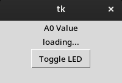

<a name="readme-top"></a>

<p align="center">
  <a href="https://github.com/adkoprek/ArudinoPySerial/graphs/contributors">
	  
  </a>
  <a href="https://github.com/adkoprek/ArudinoPySerial/network/members">
	  
  </a>
  <a href="https://github.com/adkoprek/ArudinoPySerial/stargazers">
	  
  </a>
  <a href="https://github.com/adkoprek/ArudinoPySerial/issues">
	  
  </a>
  <a href="https://github.com/adkoprek/ArudinoPySerial/blob/master/LICENSE.txt">
	  
  </a>
</p>


<br />
<div align="center">
  <a href="https://github.com/adkoprek/ArudinoPySerial">
    
  </a>

  <h3 align="center">ArduinoPySerial - GUI interface for arduino comunication</h3>

  <p align="center">
    A simple Python application to control some arduino functions from a GUI over the serial USB port.
    <br>
    <a href="https://github.com/adkoprek/USA/issues/new?labels=bug&template=bug-report---.md">Report Bug</a>
    ·
    <a href="https://github.com/adkoprek/USA/issues/new?labels=enhancement&template=feature-request---.md">Request Feature</a>
  </p>
</div>

<!-- ABOUT THE PROJECT -->
## About The Project

<p align="center">
  
</p>

A basic example of a python GUI to read and write to a Aduino over the serial port. In this example a Arduino UNO was used and the functinoallity is based on reading the a0 analog input port and sending the data over serial in a JSON format. The Arduino UNO also has a command that can be send over the serial console to toggle the pin 13, you just have to send 0.

The project consists of 2 parts the Arduino Sketch `PSI.ino` and the python GUI `main.py`
### Built With

[![Arduino][INO.js]][INO-url]
[![Python][PY.js]][PY-url]

<!-- GETTING STARTED -->
## Getting Started

If you want your own copy just follow this steps

```bash
git clone https://github.com/adkoprek/ArudinoPySerial
```

### Prerequisites
  - Python 3 interpreter
  - Arduino IDE
  - Tkinter: `pip install tk`
  - Serial: `pip isntall pyserial`

## Usage

  - Load the Sketch onto an Arduino board of your choise
  - Start the Python program

## Contributing

Contributions are what make the open source community such an amazing place to learn, inspire, and create. Any contributions you make are **greatly appreciated**.

If you have a suggestion that would make this better, please fork the repo and create a pull request. You can also simply open an issue with the tag "enhancement".
Don't forget to give the project a star! Thanks again!

1. Fork the Project
2. Create your Feature Branch (`git checkout -b feature/AmazingFeature`)
3. Commit your Changes (`git commit -m 'Add some AmazingFeature'`)
4. Push to the Branch (`git push origin feature/AmazingFeature`)
5. Open a Pull Request

## License

Distributed under the MIT License. See `LICENSE.txt` for more information.

[INO.js]: https://img.shields.io/badge/Arduino-00979D?style=for-the-badge&logo=Arduino&logoColor=white
[INO-url]: https://www.arduino.cc/
[PY.js]: https://img.shields.io/badge/Python-FFD43B?style=for-the-badge&logo=python&logoColor=blue
[PY-url]: https://python.org
